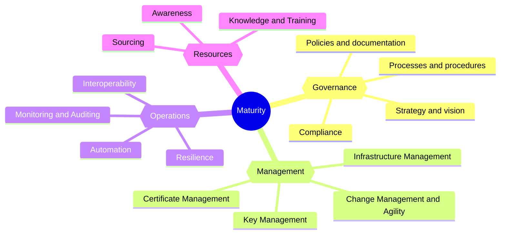

# Overview

This repository is part of the [PKI Consortium](https://pkic.org/) PKI maturity model (PKIMM) working group.

You can find more information about the working group and its goal in the [PKI Maturity Model Working Group Charter](https://pkic.org/wg/pkimm/charter/).

## Applicability

The PKI maturity model is intended for all entities that operates public key infrastructure, regardless of the size, industry, or use-case.

Whether the entity would like to follow this model is at the discretion of the entity. The model is not mandatory and does not impose any requirements on the entity.

## Goal

Our goal is to build a PKI maturity model that will be recognized around the globe as a standard for evaluation, planning, and comparison between different PKI implementations. It can also serve as a basis for additional services connected with the model, like PKI maturity assessment, or implementation and action plans definition for PKI environments.

The PKI maturity model and assessment methodology will be used as an entry point for anyone evaluating a PKI environment by itself or using an independent third party.

The adoption of the PKI maturity model must be very easy and therefore the model must be very clear and understandable by different PKI environments, use-cases, industries, and openly available for anyone to use it. Assessment methodology will be developed to support on-site and automated assessment.

## Model

The [PKI Maturity Model](./model/) defines 5 levels of the PKI maturity based on different indicators and associated risks.

The model is divided into **4** [Modules](./model/maturity-modules/) and **15** [Categories](./model/maturity-categories) that covers aspects and activities related to the PKI (people, process, technology). The overall maturity level is determined based on the maturity of the categories.

## Assessment process

The [Assessment process](./assessment/) should provide a consistent and convenient approach to assess the maturity level of any PKI implementation and use case.

The assessment process defines steps to scope, assess, evaluate, and report the maturity level of the PKI implementation, including continuous improvement.

## Assessment tools

The following assessment tools are available to support the assessment process:
- [PKI maturity assessment tool](./tools/) - Excel spreadsheet that can be used to perform the assessment and generate a report.

