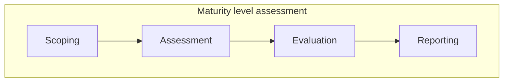
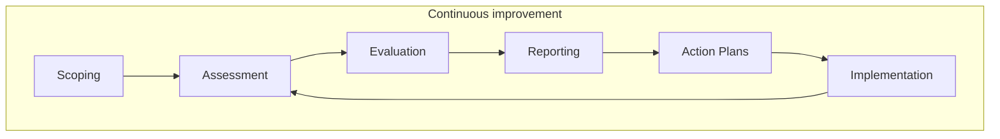

# PKI Maturity Model Assessment Process

The PKI Maturity Model assessment process consists of the following steps:

| Step | Name       | Description                                                                                                                                                                    | Reference                                                 |
|------|------------|--------------------------------------------------------------------------------------------------------------------------------------------------------------------------------|-----------------------------------------------------------|
| 1    | Scoping    | The scope definition is the first step of the assessment process. The scope defines the boundaries of the assessment and the applicability of the requirements.                | [Scoping](pkimm-scoping.md)                               |
| 2    | Assessment | The assessment is the process of evaluating the maturity of the PKI environment against the requirements defined in the maturity model within the boundaries of defined scope. | [Assessment Methodology](pkimm-assessment-methodology.md) |
| 3    | Evaluation | The evaluation is the process of analyzing the results of the assessment and determining the maturity level of the PKI environment.                                            | [Evaluation](pkimm-evaluation.md)                         |
| 4    | Reporting  | The reporting is the process of documenting the results of the assessment and evaluation.                                                                                      | [Reporting](pkimm-report.md)                              |

# Continuous improvement

While the assessment process is a one-time event, the continuous improvement is an ongoing process. The continuous improvement process is intended to ensure that the maturity level of the PKI environment is maintained and improved over time.

Continues improvement iterates over the assessment and evaluation processes with additional steps:

| Name           | Description                                                                                                                      | Reference                                 |
|----------------|----------------------------------------------------------------------------------------------------------------------------------|-------------------------------------------|
| Action Plans   | The action plans are the process of defining the actions that are required to improve the maturity level of the PKI environment. | [Action Plans](pkimm-action-plans.md)     |
| Implementation | The implementation is the process of implementing the actions defined in the action plans.                                       | [Implementation](pkimm-implementation.md) |

