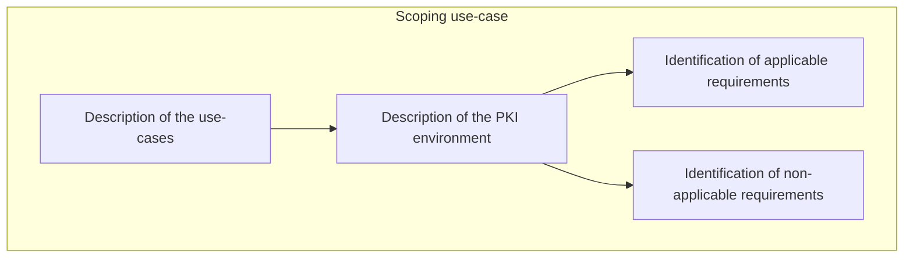
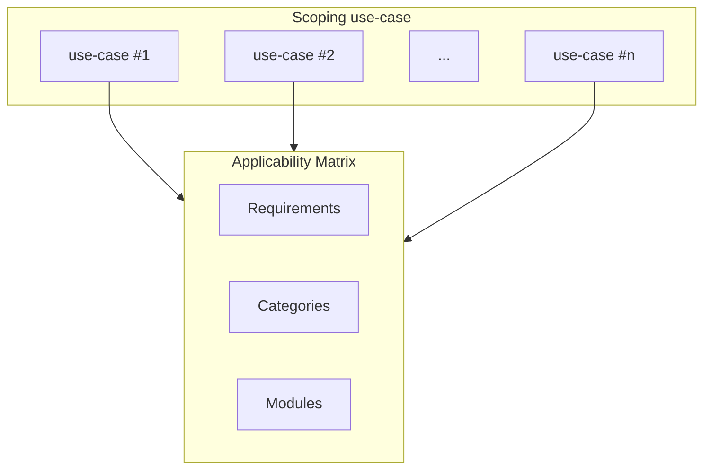

# PKI Maturity Model Scoping

The PKI MM is applicable to any entity that uses PKI. It is not limited to any particular industry or sector. However, each PKI environment is unique and the maturity model is not intended to be a one-size-fits-all solution. The maturity model is intended to be used as a tool to evaluate the maturity of the PKI environment and to identify areas for improvement.

This scoping document provides guidance on how to use properly identify the scope of the maturity model for the specific entity.

The definition of scope is important input for the assessment process. The scope defines the boundaries of the assessment and the applicability of the requirements.

> **Note**
> Scoping should be applied for a specific use-case. Each use-case may have different scope and therefore different maturity level.

> :warning:
> We are planning to prepare scoping guidance for various use-cases and applicability of standards like WebTrust, ETSI, NIST, ISO, etc.. If you are interested in contributing to this effort, please contact us.

## Scoping process

Scoping process helps to understand and define the scope of the maturity model for the specific entity. The scoping process is intended to be iterative and may be repeated several times to ensure that the scope is well defined and understood by all stakeholders.

The scoping process for each use-case consists of the following steps:
- Description of the use-cases
- Description of the PKI environment
- Identification of (non)applicable requirements

### Description of the use-cases

The first step of the scoping process is to describe the use-cases that are supported by the PKI environment. Each use-case description should include at the following information:

- Name of the use-case
- Description of the use-case
- List of components that are involved in the use-case
- Specific out-of-scope considerations

### Description of the PKI environment

The PKI environment description should include at the following information:

- High-level design of the PKI environment
- Points of interaction between parties involved in the use-cases

### Identification of (non)applicable requirements

Based on the use-case and PKI environment description, the applicable and non-applicable requirements should be identified. The requirements that are not applicable to the specific use-case and PKI environment should contains the reason of the non-applicability.

## Applicability matrix

The applicability matrix is a table that contains the list of requirements and the applicability of each requirement to the specific use-case and PKI environment.

### Applicability levels

There are the following applicability levels that should be used to describe the applicability of the requirements:
- **Applicable** - applicable to the specific use-case and PKI environment in full context
- **Not applicable** - not applicable to the specific use-case and PKI environment
- **Partially applicable** - applicable to the specific use-case and PKI environment in partial context

**Not applicable** and **Partially applicable** requirements/categories/modules should contain the reason of the non-applicability.

> **Note**
> The applicability of the requirements is defined in the context of the specific use-case and PKI environment. The applicability of the requirements may be different for other use-cases and PKI environments. The applicability matrix serves as a starting point for the scoping process and may be updated as the scoping process progresses.