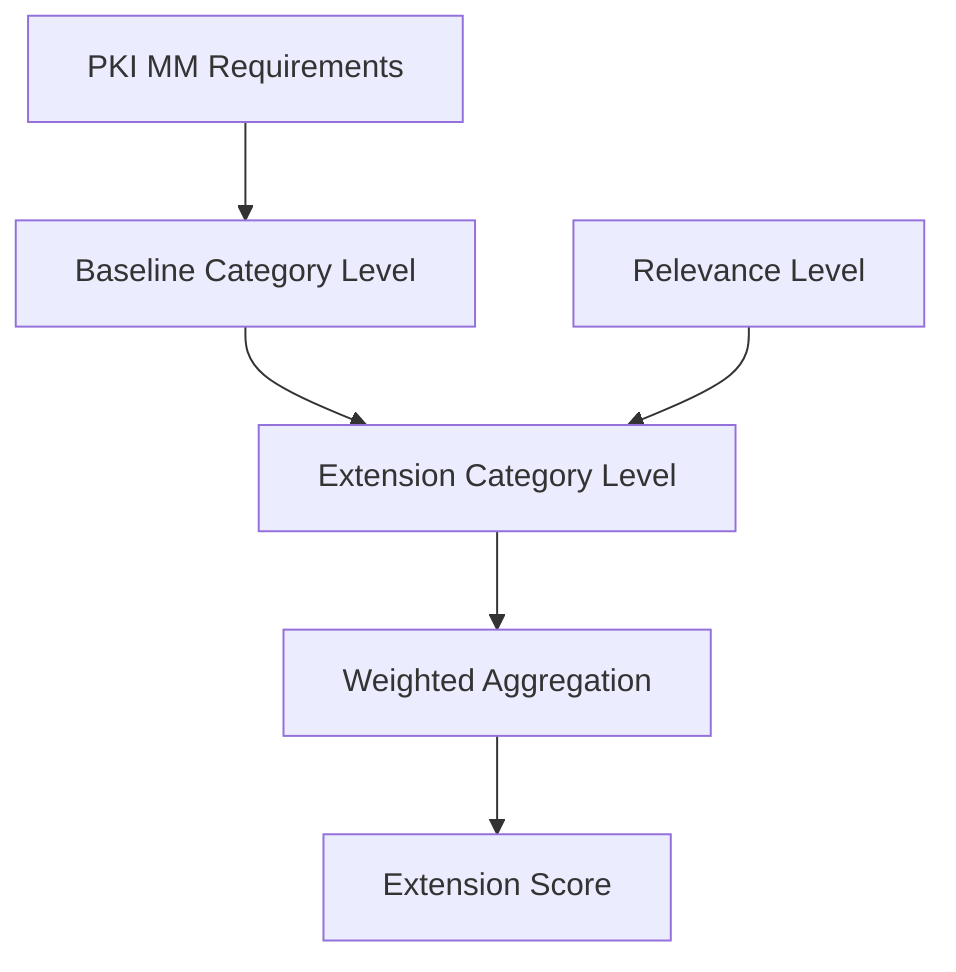

# Extension Framework

The PKI Maturity Model (PKI MM) supports a framework that allows optional, pluggable extensions to augment the model without modifying the core PKI MM definition.

Extensions enable organizations to assess additional perspectives such as emerging technologies, regulatory domains, or industry-specific requirements while preserving compatibility with the standard PKI MM scoring and reporting.

Extensions may:

- add extension-specific maturity criteria to existing PKI MM categories
- apply weight overlays (multipliers) to existing PKI MM requirements or categories
- define extension-specific scoring and reporting while still producing the standard PKI MM report

Extensions are optional and independent. They can be added or removed without changing the core PKI MM model or affecting the baseline maturity calculation.

## How Extensions Influence Maturity

> 💡 **Concept**
> 
> An extension introduces an additional maturity signal (**Relevance**) and adjusts importance (**Overlays**).\
> Think of extension scoring as:\
> **Baseline PKI MM maturity blended with an Extension maturity signal, weighted by Extension emphasis**



## Extension Design Principles

- **Non-destructive** - extensions never modify the base PKI MM definition.
- **Composable** - multiple extensions may coexist.
- **Consistent scoring** - extension scoring works the same way in:
  - full assessment (requirement-based)
  - self-assessment (category-based)
- **PKI MM-shaped structure** - extensions follow the same hierarchy: `modules → categories → requirements`.

------------------------------------------------------------------------

## Extension Structure

An extension consists of the following logical parts:

- **Extension** - metadata describing the extension.
- **Relevance** - extension-specific maturity criteria defined at category level.
- **Overlays** - weight multipliers that emphasize parts of the PKI MM.

Scoring is defined separately from the extension structure to ensure that extensions remain purely descriptive and non-destructive to the core PKI MM calculation model.

### Extension

Defines metadata such as:

-   identifier
-   version
-   description
-   compatibility with PKI MM version

The extension block does not affect scoring directly.

### Relevance

The **Relevance** section defines extension-specific maturity criteria for selected PKI MM categories.

Relevance behaves like an additional **category-level maturity signal**.

Each relevance entry **must include a relevance weight** because it participates directly in the category maturity calculation.

Each relevance entry should include:

- maturity levels (1--5)
- guidance text
- assessment instructions
- references
- relevance weight

Relevance does **not** add new PKI MM requirements or change baseline scoring.

> 📌 **Example - Relevance as additional maturity signal**
>
> If a category has baseline maturity level `3.5` and the extension relevance level is `2` with relevance weight `2`, the extension contributes an additional weighted signal used during extension scoring.

### Overlays

The **Overlays** section defines weight multipliers applied to existing PKI MM items when calculating extension scores.

Overlays change **importance**, not maturity levels.

Each overlay **must include a rationale** explaining why the multiplier is applied.  
The rationale provides transparency and helps reviewers understand the intent of the extension.

Overlays may be defined at:

- category level
- requirement level

The effective weight is calculated as:

`effective_weight = base_weight × multiplier`

If multiple overlays apply to the same item (for example both category and requirement overlays), the multipliers are combined multiplicatively:

`effective_weight = base_weight × multiplier₁ × multiplier₂ × ...`

> 💡 **Concept**
>
> Overlays adjust how strongly an area influences extension scoring.
> They never modify the actual maturity levels entered by the user.

> 📌 **Example – Requirement overlay**
>
> Requirement weight = `2`  
> Requirement multiplier = `1.5`
>
> Effective requirement weight = `2 × 1.5 = 3`

> 📌 **Example – Category + Requirement overlay**
>
> Base weight = `2`  
> Category multiplier = `1.5`  
> Requirement multiplier = `2.0`
>
> Effective requirement weight = `2 × 1.5 × 2.0 = 6`

------------------------------------------------------------------------

## Assessment

Extension scoring supports two assessment modes.  
Both modes use the same scoring model, but differ in how category maturity levels are obtained.

| Aspect                 | Full Assessment              | Self-Assessment               |
|------------------------|------------------------------|-------------------------------|
| Requirement details    | Used                         | Not used                      |
| Category level source  | Calculated from requirements | Provided directly by the user |
| Category weights       | Used                         | Used                          |
| Scoring math (overall) | Same                         | Same                          |

> 💡 **Concept**
>
> The difference between assessment modes exists only at the **requirement aggregation stage**.
> Once a category maturity level exists, extension scoring behaves identically.

### Full Assessment

In full assessment mode:

- Requirement maturity levels are provided by the user.
- Category maturity levels are calculated as a weighted average of requirement levels (using requirement weights, optionally adjusted by overlays).
- Overall PKI MM maturity is calculated as a weighted average of category maturity levels (using category weights, optionally adjusted by overlays).

> 🔧 **Implementation detail**
>
> Requirement overlays affect category maturity calculation only (because requirements are part of the full assessment).
> Category overlays affect the overall maturity calculation.

### Self-Assessment

In self-assessment mode:

- Requirement details are not evaluated.
- Users provide category maturity levels directly.
- Overall PKI MM maturity is calculated as a weighted average of category maturity levels (using category weights, optionally adjusted by overlays).

> 🔧 **Implementation detail**
>
> Requirement overlays are applied to the model weights but do not depend on requirement-level user inputs in self-assessment.
> Category overlays apply normally.

> 📌 **Example – Why scoring stays consistent**
>
> Both modes compute the overall score from category maturity levels and category weights using the same formula.
> The only difference is how category maturity levels are obtained:
>
> - Full assessment: derived from requirement answers
> - Self-assessment: entered directly by the user

---

## Scoring Model Details

The PKI MM calculates maturity in two stages:

1. **Category maturity level** is calculated from requirements as a weighted average of requirement maturity levels.
2. **Overall PKI MM maturity** is calculated as a weighted average of category levels.

Extensions reuse this same model to ensure consistency.

> 🔧 **Normative Rule**
>
> Extensions MUST NOT modify the baseline category level calculation or the PKI MM aggregation model.
>
> Extensions may influence scoring only through:
> - relevance definitions (including relevance weights)
> - overlays (weight multipliers applied to PKI MM items)

### Extension Category Level

The extension category level blends the baseline category maturity with the extension relevance maturity.

Let:

- `Level_C` be the baseline PKI MM category level
- `WeightSum_C` be the baseline aggregation weight of the category, calculated as the sum of effective requirement weights after overlays. This value depends only on the PKI MM model and overlay multipliers and does **not** depend on user-selected maturity levels.
- `RelLevel_C` be the relevance maturity level
- `RelWeight_C` be the relevance weight

The extension category level is calculated as:

```
ExtensionCategoryLevel_C =

(Level_C × WeightSum_C + RelLevel_C × RelWeight_C)
------------------------------------
(WeightSum_C + RelWeight_C)
```

If relevance is not defined for a category:

`ExtensionCategoryLevel_C = Level_C`

> 💡 **Concept**
>
> `WeightSum_C` represents the baseline aggregation strength of the category.
> It is derived from requirement weights and overlays and does **not** represent the PKI MM category weight (`effective_category_weight`)
used during overall score aggregation.
>
> Relevance behaves like an additional weighted maturity signal added
> at the category aggregation stage.

> 📌 **Example – Extension category level**
>
> Baseline category level (`Level_C`) = `3.6`  
> Baseline aggregation weight (`WeightSum_C`) = `7.5`  
> Relevance level (`RelLevel_C`) = `2`  
> Relevance weight (`RelWeight_Cz`) = `2`  
>
> ExtensionCategoryLevel = `(3.6×7.5 + 2×2) / (7.5 + 2)`  
> = `(27 + 4) / 9.5`  
> = `31 / 9.5`  
> = `3.26`

### Category Weight

Category weights remain explicit values defined by the PKI MM model or extension overlays.

Overlays may modify category weights using multipliers:

`effective_category_weight = base_category_weight × multiplier`

> 🔧 **Implementation detail**
>
> Requirement overlays influence category maturity calculation only.
> Category overlays influence overall aggregation.

### Extension Progress Score

The extension progress score is calculated as a weighted average of extension category levels:

```
ExtensionScore =
Σ(ExtensionCategoryLevel_C × effective_category_weight)
-------------------------------------------------------
Σ(effective_category_weight)
```

> 📌 **Example – Extension score**
>
> Category `G.1` level = `2.53` with weight `4`  
> Category `G.2` level = `3.0` with weight `6`  
>
> ExtensionScore = `(2.53×4 + 3×6) / (4 + 6)`  
> = `(10.12 + 18) / 10`  
> = `2.81`  

### Extension Floor Score (Optional)

The floor score represents the lowest extension maturity across categories:

`ExtensionFloor = minimum(ExtensionCategoryLevel_C)`

This highlights weakest-link maturity risks.

### Extension-Weighted PKI MM Score

Extensions may also provide a PKI MM view using extension-adjusted category weights:

```
ExtensionWeightedPKIMM =

Σ(Level_C × effective_category_weight)
--------------------------------------
Σ(effective_category_weight)
```

This recalculates baseline PKI MM maturity using extension emphasis while preserving baseline maturity values.

### Example – Scoring Behavior in Full Assessment vs Self-Assessment

The extension scoring formula is identical in both assessment modes.
The only difference is how the baseline category maturity level (`Level_C`) is obtained.

- In **full assessment**, `Level_C` is calculated from requirement maturity values.
- In **self-assessment**, the user selects `Level_C` directly (1–5) based on the category maturity description.

Because the input resolution differs, the numerical result may differ slightly, but the scoring behavior remains consistent.

> 📌 **Full Assessment Example**
>
> Category maturity derived from requirements:
>
> Baseline category level (`Level_C`) = `3.6`  
> Baseline aggregation weight (`WeightSum_C`) = `7.5`  
> Relevance level (`RelLevel_C`) = `2`  
> Relevance weight (`RelWeight_C`) = `2`  
>
> ExtensionCategoryLevel = `(3.6×7.5 + 2×2) / (7.5 + 2)`  
> = `(27 + 4) / 9.5`  
> = `31 / 9.5`  
> = `3.26`  

> 📌 **Self-Assessment Example**
>
> In the self-assessment application, the user selects a discrete maturity level:
>
> Baseline category level (`Level_C`) = **`4`**  
> Baseline aggregation weight (`WeightSum_C`) = `7.5`  
> Relevance level (`RelLevel_C`) = `2`  
> Relevance weight (`RelWeight_C`) = `2`
>
> ExtensionCategoryLevel = `(4×7.5 + 2×2) / (7.5 + 2)`  
> = `(30 + 4) / 9.5`  
> = `34 / 9.5`  
> = `3.58`  

#### Consistency Clarification

Full assessment and self-assessment use the **same scoring model**. The difference in results comes only from the source of the category level:

- full assessment → calculated weighted average
- self-assessment → user-selected maturity level (1–5)

Extension scoring always operates at the **category aggregation stage**, which guarantees consistent behavior across both assessment modes.
