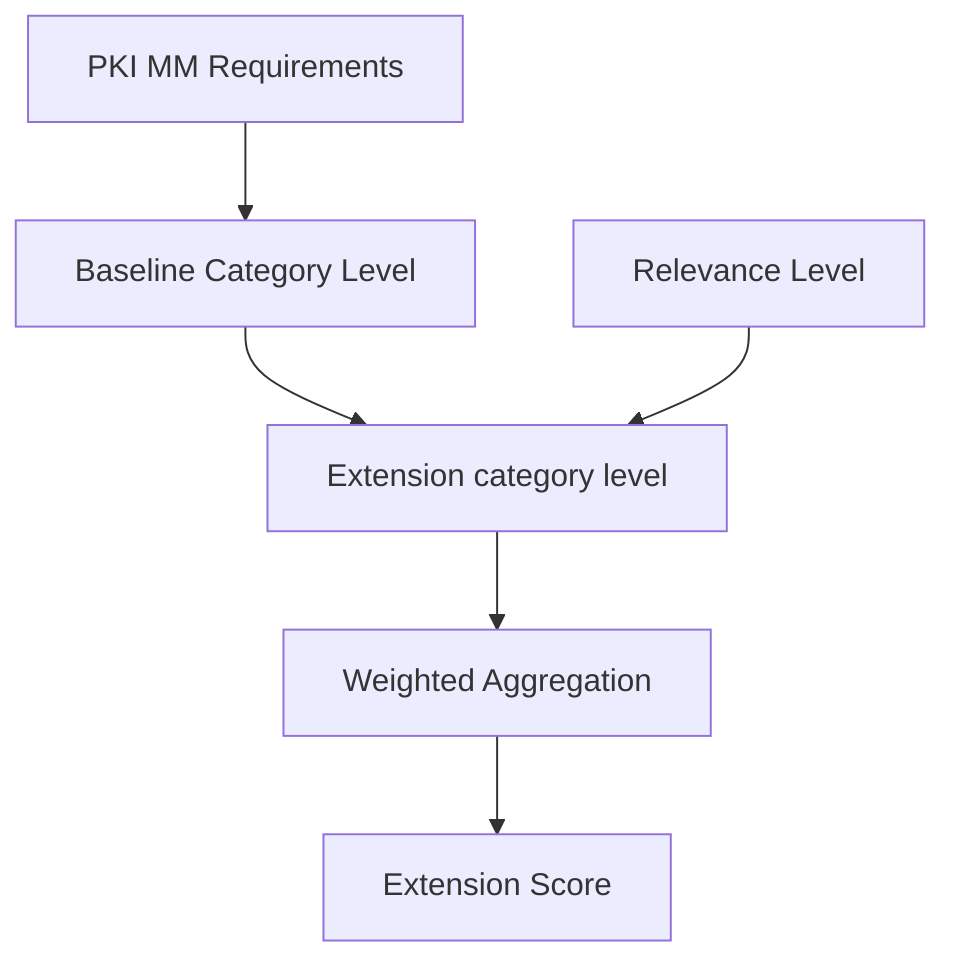

# Extension framework

The PKI Maturity Model (PKI MM) supports a framework that allows optional, pluggable extensions to augment the model without modifying the core PKI MM definition.

Extensions enable organizations to assess additional perspectives such as emerging technologies, regulatory domains, or industry-specific requirements while preserving compatibility with the standard PKI MM scoring and reporting.

Extensions may:

- add extension-specific maturity criteria to existing PKI MM categories
- apply weight overlays to existing PKI MM requirements or categories
- define extension-specific scoring and reporting while still producing the standard PKI MM report

Extensions are optional and independent. They can be added or removed without changing the core PKI MM model or affecting the baseline maturity calculation.

## How extensions influence maturity

> 💡 **Concept**
>
> An extension introduces an additional maturity signal (**Relevance**) and adjusts importance (**Overlays**).\
> Think of extension scoring as:\
> **Baseline PKI MM maturity blended with an Extension maturity signal, weighted by Extension emphasis**

## Design principles

- **Non-destructive** — extensions never modify the base PKI MM definition.
- **Composable** — multiple extensions may coexist; each is scored independently against the same baseline.
- **Consistent scoring** — extension scoring works the same way in full assessment (requirement-based) and self-assessment (category-based).
- **PKI MM-shaped structure** — extensions follow the same hierarchy: `modules → categories → requirements`.

## Where to go next

- **[Extension structure](./structure/)** — what fields make up an extension definition (metadata, Relevance, Overlays). Read this if you are authoring a new extension.
- **[Scoring model](./scoring/)** — formulas, order-of-operations, and the end-to-end worked example. Read this if you are implementing tooling for an extension.
- **[Extension catalog](./catalog/)** — the list of working-group extensions with documentation and YAML definitions.
- **[Extension JSON Schema](./extension.schema.json)** — the canonical machine-readable contract for extension YAML files.
- **[Extension framework FAQ](../faq/#extension-framework)** — answers to common questions including non-destructive design, multi-extension behavior, and overlay tunability.
