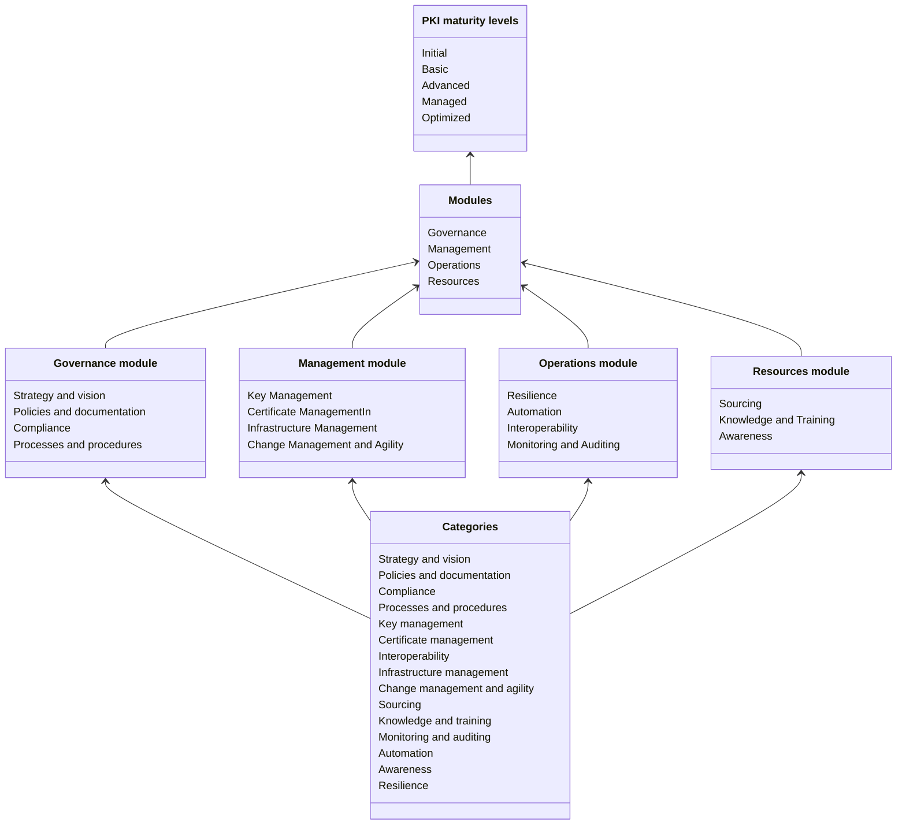

# PKI maturity model

The objective of this document is to provide a definition of the PKI maturity model and what is the maturity assessment process and procedures in order to rate the current maturity level according the model and track progress.

## Maturity model

The maturity model is based on the Capability Maturity Model Integration ([CMMI](https://en.wikipedia.org/wiki/Capability_Maturity_Model_Integration)) developed by Carnegie Mellon University. It should provide the following::
- Quickly understand the current level of capabilities and performance of the PKI
- Support comparison of PKI maturity with similar organizations based on size or industry (anonymized)
- Action plans on how to improve the capabilities of the current PKI
- Improve overall PKI performance

### Maturity levels

The maturity model consists of several categories which are directly associated with the PKI and covers all aspects and activities (people, processes, technology). Based on the maturity model parts, the overall maturity level is determined as a single value representing the current state of capabilities and performance.

Each category can be separately assessed for its maturity level. Maturity levels are generally defined as follows:

| **Maturity level** | **Short description (general)**                                                                              |
|--------------------|--------------------------------------------------------------------------------------------------------------|
| **Initial**        | Unpredictable process with poor control and always reactive                                                  |
| **Basic**          | Process is characterized by each particular case or project and controls are often reactive                  |
| **Advanced**       | Process is characterized by organizational standards and controls are proactive                              |
| **Managed**        | Processes are measured and controlled, proactive approach                                                    |
| **Optimized**      | Continuous improvement of the processes and procedures, proactive approach for future technology improvement |

For a complete description of each maturity level, refer to [Levels Description](./maturity-levels/).

## Structure of the model

The maturity model is divided into modules and modules are divided into several categories that cover aspects and activities related to the PKI (people, process, technology). The overall maturity level is determined based on the maturity of the categories.

For more information refer to:
- [Modules](./maturity-modules/)
- [Categories](./maturity-categories/)

The following diagram shows the structure of the model:

