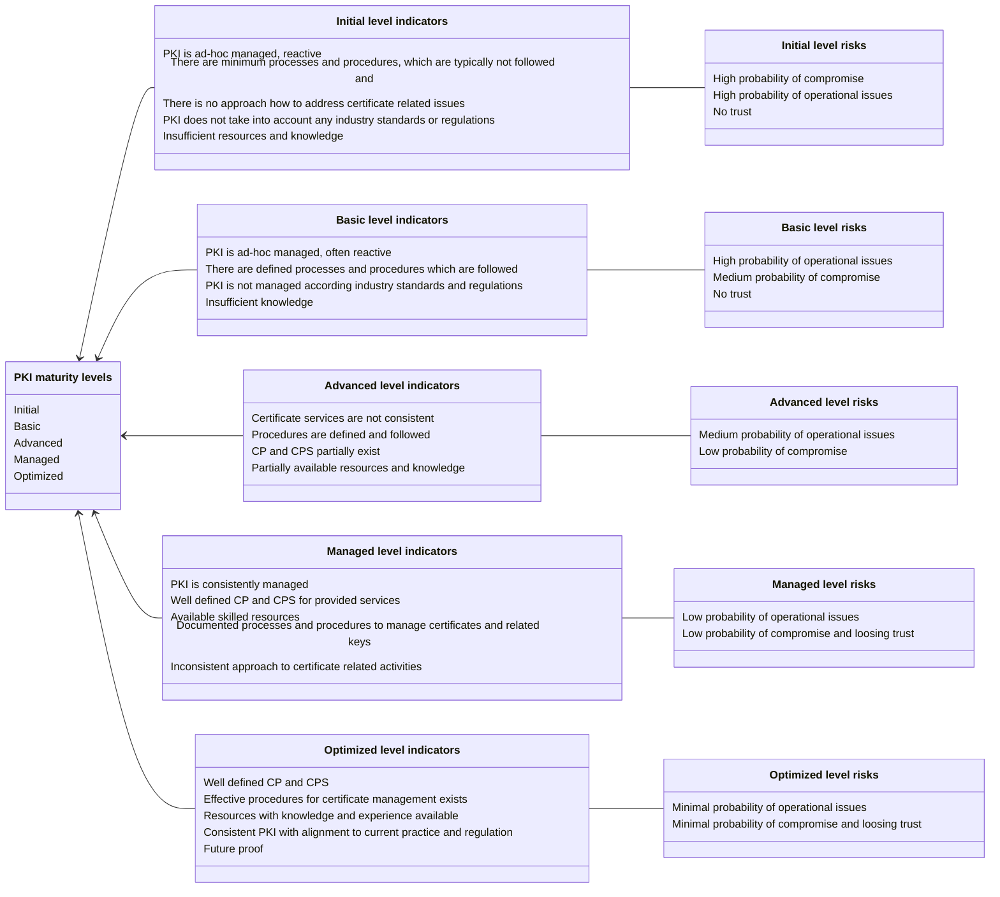

# Levels description

Based on the nature of PKI part, these maturity levels are described accordingly. Overall maturity level is calculated as weighted average of maturity level of PKI categories.

There are defined the following overall maturity levels for the PKI Maturity Model:

| **Maturity level** | **Indicators**                                                                                                                                                                                                                                                                                                                                    | **Associated risks**                                                                                                       |
|--------------------|---------------------------------------------------------------------------------------------------------------------------------------------------------------------------------------------------------------------------------------------------------------------------------------------------------------------------------------------------|----------------------------------------------------------------------------------------------------------------------------|
| **1 – Initial**    | <ul> <li>PKI is ad-hoc managed, reactive</li> <li>There are minimum processes and procedures, which are typically not followed and</li> <li>There is no approach how to address certificate related issues</li> <li>PKI does not take into account any industry standards or regulations</li> <li>Insufficient resources and knowledge</li> </ul> | <ul> <li>High probability of compromise</li> <li>High probability of operational issues</li> <li>No trust</li> </ul>       |
| **2 - Basic**      | <ul> <li>PKI is ad-hoc managed, often reactive</li> <li>There are defined processes and procedures which are followed</li> <li>PKI is not managed according industry standards and regulations</li> <li>Insufficient knowledge</li> </ul>                                                                                                         | <ul> <li>High probability of operational issues</li> <li>Medium probability of compromise</li> <li>No trust</li> </ul>     |
| **3 – Advanced**   | <ul> <li>Certificate services are not consistent</li> <li>Procedures are defined and followed</li> <li>CP and CPS partially exist</li> <li>Partially available resources and knowledge</li> </ul>                                                                                                                                                 | <ul> <li>Medium probability of operational issues</li> <li>Low probability of compromise</li> </ul>                        |
| **4 – Managed**    | <ul> <li>PKI is consistently managed</li> <li>Well defined CP and CPS for provided services</li> <li>Available skilled resources</li> <li>Documented processes and procedures to manage certificates and related keys</li> <li>Inconsistent approach to certificate related activities</li> </ul>                                                 | <ul> <li>Low probability of operational issues</li> <li>Low probability of compromise and loosing trust</li> </ul>         |
| **5 – Optimized**  | <ul> <li>Well defined CP and CPS</li> <li>Effective procedures for certificate management exists</li> <li>Resources with knowledge and experience available</li> <li>Consistent PKI with alignment to current practice and regulation</li> <li>Future proof</li> </ul>                                                                            | <ul> <li>Minimal probability of operational issues</li> <li>Minimal probability of compromise and loosing trust</li> </ul> |

