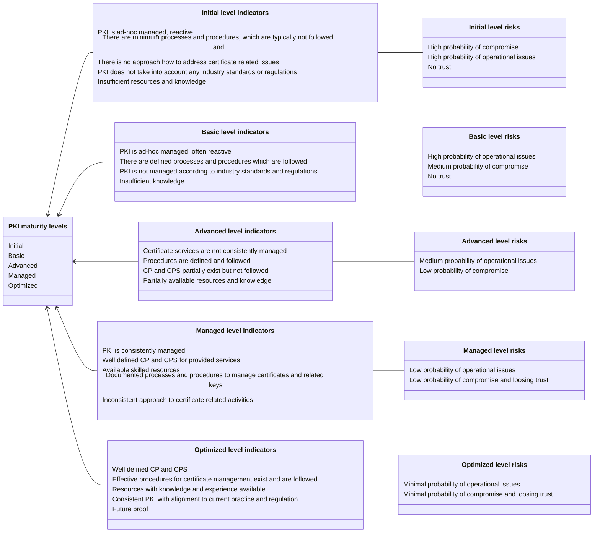

# Levels

Based on the nature of PKI part, these maturity levels are described accordingly. Overall maturity level is calculated as weighted average of the maturity level of all PKI categories.

Following overall maturity levels are defined for the PKI maturity model:

| # | **Maturity level**                         | **Short description**                                                                                        |
|---|--------------------------------------------|--------------------------------------------------------------------------------------------------------------|
| 1 | **[Initial](#initial-maturity-level)**     | Unpredictable process with poor control and always reactive                                                  |
| 2 | **[Basic](#basic-maturity-level)**         | Process is characterized by each particular case or project and controls are often reactive                  |
| 3 | **[Advanced](#advanced-maturity-level)**   | Process is characterized by organizational standards and controls are proactive                              |
| 4 | **[Managed](#managed-maturity-level)**     | Processes are measured and controlled, proactive approach                                                    |
| 5 | **[Optimized](#optimized-maturity-level)** | Continuous improvement of the processes and procedures, proactive approach for future technology improvement |

Each maturity level is described in more detail with associated indicators and risks. Indicators describes the current state of the PKI and associated risks are used to determine impact on the PKI.

## Initial maturity level

### Indicators

- PKI is ad-hoc managed, reactive
- There are minimum processes and procedures, which are typically not followed and
- There is no approach how to address certificate related issues
- PKI does not take into account any industry standards or regulations
- Insufficient resources and knowledge

### Associated risks

- High probability of compromise
- High probability of operational issues
- No trust

## Basic maturity level

### Indicators

- PKI is ad-hoc managed, often reactive
- There are defined processes and procedures which are followed
- PKI is not managed according to industry standards and regulations
- Insufficient knowledge

### Associated risks

- High probability of operational issues
- Medium probability of compromise
- No trust

## Advanced maturity level

### Indicators

- Certificate services are not consistently managed
- Procedures are defined and followed
- CP and CPS partially exist but not followed
- Partially available resources and knowledge

### Associated risks

- Medium probability of operational issues
- Low probability of compromise

## Managed maturity level

### Indicators

- PKI is consistently managed
- Well defined CP and CPS for provided services
- Available skilled resources
- Documented processes and procedures to manage certificates and related keys
- Inconsistent approach to certificate related activities

### Associated risks

- Low probability of operational issues
- Low probability of compromise and loosing trust

## Optimized maturity level

### Indicators

- Well-defined CP and CPS
- Effective procedures for certificate management exist and are followed
- Resources with knowledge and experience available
- Consistent PKI with alignment to current practice and regulation
- Future proof

### Associated risks

- Minimal probability of operational issues
- Minimal probability of compromise and loosing trust

## Maturity levels diagram

