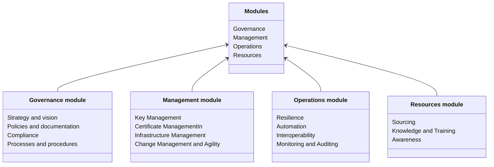

# Modules

There are 4 modules defined for the maturity model. Each of the module is focused on the specific parts of the PKI.

| Module         | Description                                                                                                                                                                                            |
|----------------|--------------------------------------------------------------------------------------------------------------------------------------------------------------------------------------------------------|
| **Governance** | Consist of the leadership, overall structures, and processes to enable organization using the PKI in a sustainable way. In also consists of having strategy and objectives and proper decision making  |
| **Management** | Translates the governance into actions that support the PKI, management of the resources to maintain the required level of trust                                                                       |
| **Operations** | Includes day to day business as usual activities that lead to secure and future-proof PKI in accordance with the organization goals                                                                    |
| **Resources**  | Ensures that the activities related to the PKI are performed with a proper knowledge and experience, with enough capacities, and that it provides complete and accurate information to relying parties |

## Modules and categories

Each module consists of specific categories related to them:

For more information about the categories, see the [Categories](../maturity-categories/).
